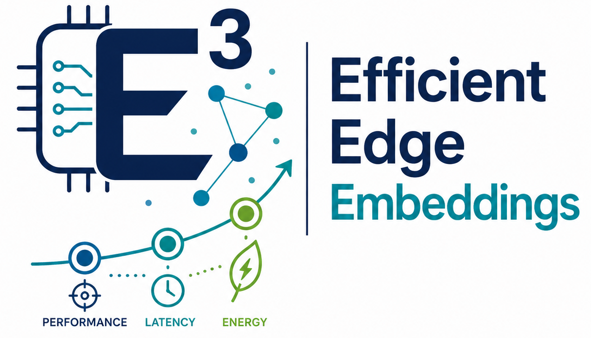

# E*3: Energy-Efficient Embedding Optimization
### Optimizing Embedding Models for Edge-Class Hardware

(Repository under construction)

  

  
  
  
  

---

## 📖 Overview

**E*3** provides a practical framework to benchmark and optimize embedding models specifically for hardware with limited compute and power budgets. 

By measuring actual inference latency and estimating energy usage, E*3 applies a **multi-objective evolutionary search** to identify the strongest trade-offs between speed, efficiency, and embedding quality.

> **Core Value:** Move beyond theoretical FLOPs. E*3 benchmarks on *your* actual hardware to find the sweet spot between `int4` speed and `fp32` accuracy.

---

## ✨ Key Features

---

## ⚙️ How It Works

The system outputs the "Pareto Frontier"—the set of optimal configurations where no single metric can be improved without sacrificing another. This is visualized as an Energy–Accuracy scatter plot.

---

## 📜 License
This project is licensed under the **MIT License**.

