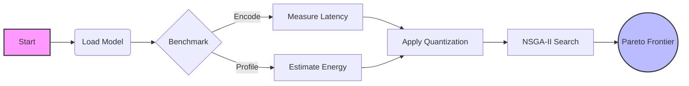

# E*3: Energy-Efficient Embedding Optimization
### Optimizing Embedding Models for Edge-Class Hardware

  

  
  
  
  

---

## 📖 Overview

**E*3** provides a practical framework to benchmark and optimize embedding models specifically for hardware with limited compute and power budgets. 

By measuring actual inference latency and estimating energy usage, E*3 applies a **multi-objective evolutionary search** to identify the strongest trade-offs between speed, efficiency, and embedding quality.

> **Core Value:** Move beyond theoretical FLOPs. E*3 benchmarks on *your* actual hardware to find the sweet spot between `int4` speed and `fp32` accuracy.

---

## ✨ Key Features

| ⚡ **Performance & Power** | 🧠 **Intelligence & Search** | 📊 **Analysis** |
| :--- | :--- | :--- |
| **Real Inference Timing** Benchmarks on actual CPU/GPU hardware (no simulations). | **NSGA-II Optimization** Evolutionary search over model and quantization parameters. | **Pareto Frontier** Automatically identifies and extracts optimal configurations. |
| **Energy Estimation** Links latency to device power profiles for Joules/inference data. | **Quantization Modes** Support for `fp32`, `int8`, and `int4` precision. | **Visual Reports** Scatter plots for Energy vs. Accuracy trade-offs. |
| **Smart Caching** Prevents redundant benchmarks to speed up search. | **Direct Execution** Native support for `SentenceTransformer` models. | **Multi-Objective** Balances Energy, Latency, and Accuracy simultaneously. |

---

## ⚙️ How It Works

E*3 follows a modular pipeline to evaluate and optimize your models.

### 1. Model Loading
Models are loaded dynamically on first use to conserve resources until benchmarking begins.

### 2. Latency Measurement ⏱️
A standardized collection of sentences is encoded multiple times. **E*3** computes the **average latency per encoding pass** to ensure statistical significance.

### 3. Energy Estimation 🔋
Energy usage is derived by correlating the measured latency with the declared thermal design power (TDP) or power profile of the specific edge device.

### 4. Accuracy Modification 🎯
Quantization impacts accuracy. **E*3** applies specific accuracy shifts for:
* `fp32` (Baseline)
* `int8`
* `int4`

### 5. Multi-Objective Search 🧬
The **NSGA-II** algorithm iterates through generations of model/quantization combinations. Cached timing results are strictly reused to minimize search overhead.

### 6. Pareto Frontier Visualization 📉
The system outputs the "Pareto Frontier"—the set of optimal configurations where no single metric can be improved without sacrificing another. This is visualized as an Energy–Accuracy scatter plot.

---

## 📜 License
This project is licensed under the **MIT License**.

