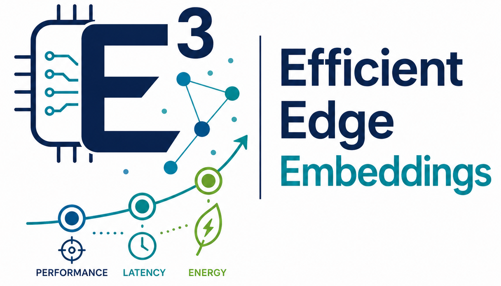

# E*3: Optimizing Embedding Models for Edge-Class Hardware

<p align="center">
  
</p>

<p align="center">
  
  
  
</p>

---

## 📋 Table of Contents

1. [Overview](#-overview)
2. [Key Features](#-key-features)
3. [Project Structure](#-project-structure)
4. [Installation](#-installation)
5. [Quick Start](#-quick-start)
6. [Usage Guide](#-usage-guide)
   - [Semantic Similarity](#semantic-similarity-pareto-similaritypy)
   - [Text Classification](#text-classification-pareto-classificationpy)
   - [Text Clustering](#text-clustering-pareto-clusteringpy)
   - [Real-Time Mode](#real-time-mode-pareto-real-timepy)
   - [Quantization](#quantization-pareto-mlxpy)
   - [Streamlit Dashboard](#streamlit-dashboard-master_streamlit_apppy)
7. [Configuration Reference](#-configuration-reference)
8. [Understanding the Output](#-understanding-the-output)
9. [The Knee-Point Rule](#-the-knee-point-rule)
10. [Design Implications](#-design-implications)
11. [FAQ / Troubleshooting](#-faq--troubleshooting)
12. [Ethics & Responsible AI](#%EF%B8%8F-ethics--responsible-ai)
13. [Citation](#-citation)
14. [Acknowledgments](#-acknowledgments)
15. [License](#-license)

---

## 📖 Overview

**E\*3 (Efficient Edge Embeddings)** is a framework for benchmarking and optimizing sentence embedding models under strict computational and energy constraints. It is designed for scenarios where latency and power consumption are not secondary concerns but primary deployment limits — in particular, edge-class hardware where resources are scarce and sustainability matters.

Instead of treating model selection as a single-objective problem, E\*3 simultaneously measures real inference latency, estimates energy consumption via [CodeCarbon](https://codecarbon.io/), and evaluates task performance (semantic similarity, classification accuracy, or clustering quality). This three-objective formulation is solved using Optuna's multi-objective optimization (NSGA-II), yielding a Pareto front of non-dominated configurations that represent the full trade-off surface.

Pareto dominance is used to separate viable configurations from those that are strictly worse on all three objectives. A **knee-point rule** then identifies a single recommended configuration when no external preference is available — the point where performance gains per unit of added cost are highest. This approach, funded by the EU Horizon Europe **dAIEDGE** project (grant 101120726, subgrant 2dAI2OC07), makes it straightforward to pick a defensible embedding configuration for resource-constrained deployment without sacrificing transparency or reproducibility.

---

## ✨ Key Features

- **3-objective Pareto optimization** across latency (ms), energy (kWh), and task performance
- **Multiple NLP tasks**: semantic similarity (STS-B), text classification (SST-2 / AG News), text clustering (AG News)
- **Real-time mode**: forced `batch_size=1` to profile single-request latency
- **Quantization support**: raw NumPy groupwise quantization with optional Apple MLX backend on Apple Silicon
- **Automated knee-point selection** when no preference is specified
- **Interactive 3D Pareto visualizations** (offline Plotly HTML + paper-ready PDFs)
- **Streamlit dashboard** ("Pareto Lab") for running all modules through a web UI
- **Pre-computed results** in `results/` for reference and rapid comparison
- **Transparent configuration tuples** covering model, dimensionality, batch size, normalization, projection, and quantization

---

## 🗂️ Project Structure

```
efficient-edge-embeddings/
├── pareto-similarity.py        # STS-B semantic similarity (Pearson r) 3-objective optimization
├── pareto-classification.py    # Text classification (SST-2 / AG News) 3-objective optimization
├── pareto-clustering.py        # Text clustering (AG News, NMI) 3-objective optimization
├── pareto-real-time.py         # STS-B with batch_size=1 (real-time latency constraint)
├── pareto-mlx.py               # STS-B with embedding quantization (NumPy + optional Apple MLX)
├── master_streamlit_app.py     # Streamlit dashboard ("Pareto Lab") for all modules
├── configs/
│   └── default.yaml            # Default model candidate list
├── results/                    # Pre-computed Pareto solutions for reference
├── runs/                       # Timestamped output folders created by Streamlit runs
├── requirements.txt            # Python dependencies
└── logo.png                    # Project logo
```

---

## 🛠️ Installation

### Prerequisites

- Python 3.8 or higher
- `pip`
- `git`

### Step-by-step

```bash
# 1. Clone the repository
git clone https://github.com/jorge-martinez-gil/efficient-edge-embeddings.git
cd efficient-edge-embeddings

# 2. (Recommended) Create and activate a virtual environment
python -m venv .venv
source .venv/bin/activate      # macOS / Linux
# .venv\Scripts\activate       # Windows

# 3. Install core dependencies
pip install -r requirements.txt

# 4. (Optional) Apple Silicon quantization backend
pip install mlx

# 5. (Optional) Verify scikit-learn is available
python -c "import sklearn; print(sklearn.__version__)"
```

> **Note:** `scikit-learn` is already pulled in as a transitive dependency of `sentence-transformers`, but it is worth verifying it is installed before running classification or clustering experiments.

---

## 🚀 Quick Start

Run the semantic similarity optimization end-to-end:

```bash
python pareto-similarity.py
```

This will:
1. Download the GLUE STS-B validation split (~1 500 sentence pairs) from Hugging Face
2. Run 40 Optuna trials, each evaluating a different embedding configuration
3. Print the Pareto-optimal solutions to the console
4. Write the following output files to the current directory:
   - `pareto_solutions.csv` — Pareto-optimal configurations with latency, energy, and Pearson r
   - `pareto_3d_interactive.html` — Offline interactive 3D Pareto plot (open in any browser)
   - `fig_pareto3d.pdf` — Vector PDF for papers (3D view)
   - `fig_proj_latency_accuracy.pdf` — 2D projection: latency vs Pearson r
   - `fig_proj_energy_accuracy.pdf` — 2D projection: energy vs Pearson r

---

## 📘 Usage Guide

### Semantic Similarity (`pareto-similarity.py`)

Benchmarks embedding configurations on the **GLUE STS-B** (Semantic Textual Similarity Benchmark) validation split. The task metric is **Pearson correlation** between predicted cosine similarities and human-annotated sentence-pair scores.

**Configuration constants** (edit at the top of the script):

| Constant | Default | Description |
|---|---|---|
| `N_TRIALS` | `40` | Number of Optuna trials. Use 200–400 for paper-quality Pareto fronts. |
| `MAX_PAIRS` | `1500` | Max sentence pairs evaluated per trial. `None` → use the full split (~1 379 pairs). |
| `WARMUP_PAIRS` | `128` | Pairs used for a warm-up pass (not measured) to stabilize latency readings. |
| `CC_DIR` | `".cc_logs"` | Directory for CodeCarbon log files. Created automatically if absent. |

**Output files:**

- `pareto_solutions.csv`
- `pareto_3d_interactive.html`
- `fig_pareto3d.pdf`, `fig_proj_latency_accuracy.pdf`, `fig_proj_energy_accuracy.pdf`

---

### Text Classification (`pareto-classification.py`)

Benchmarks embedding configurations as feature extractors for **text classification** using lightweight downstream classifiers (Logistic Regression or LinearSVC).

**Supported tasks** (set `TASK` constant):
- `"sst2"` — GLUE SST-2 (binary sentiment, ~67k train / 872 eval)
- `"ag_news"` — AG News (4-class topic, ~120k train / 7 600 eval)

**Configuration constants:**

| Constant | Default | Description |
|---|---|---|
| `TASK` | `"ag_news"` | Benchmark task (`"sst2"` or `"ag_news"`). |
| `N_TRIALS` | `20` | Number of Optuna trials. |
| `MAX_TRAIN` | `1000` | Max training samples subsampled per trial. |
| `MAX_EVAL` | `500` | Max evaluation samples subsampled per trial. |
| `WARMUP_SAMPLES` | `128` | Warm-up samples (not measured). |
| `RANDOM_SEED` | `0` | Seed for reproducible subsampling. |

**Output files:** same set as `pareto-similarity.py`.

---

### Text Clustering (`pareto-clustering.py`)

Benchmarks embedding configurations for **unsupervised text clustering** using MiniBatchKMeans. The task metric is **Normalized Mutual Information (NMI)** between predicted cluster assignments and ground-truth labels.

**Default dataset:** AG News (`test` split, up to 2 000 samples).

**Configuration constants:**

| Constant | Default | Description |
|---|---|---|
| `N_TRIALS` | `3` | Number of Optuna trials (increase for real experiments). |
| `MAX_SAMPLES` | `2000` | Max samples evaluated per trial. |
| `WARMUP_SAMPLES` | `128` | Warm-up samples (not measured). |
| `DATASET_NAME` | `"ag_news"` | HuggingFace dataset name. |
| `DATASET_SPLIT` | `"test"` | Dataset split to use. |

**Output files:** `pareto_solutions.csv`, `pareto_3d_interactive.html`, `fig_pareto3d.pdf`, `fig_proj_latency_quality.pdf`, `fig_proj_energy_quality.pdf`.

---

### Real-Time Mode (`pareto-real-time.py`)

Identical to `pareto-similarity.py` but with **`BATCH_SIZE` fixed to 1** throughout the entire optimization. This enforces a real-time latency constraint that reflects single-request inference rather than batch throughput.

Use this mode when profiling deployments where requests arrive one at a time (e.g., live chat, API endpoints with SLA requirements).

**Additional constant:**

| Constant | Default | Description |
|---|---|---|
| `BATCH_SIZE` | `1` | Fixed batch size — not a search parameter in this script. |

---

### Quantization (`pareto-mlx.py`)

Extends `pareto-similarity.py` with **embedding quantization** as an additional optimization knob. The quantization pipeline uses raw NumPy groupwise quantization (symmetric or affine) by default, and automatically switches to **Apple MLX** on Apple Silicon when the `mlx` package is installed.

- **Groupwise quantization** splits each embedding vector into groups of `group_size` elements and quantizes each group independently, reducing memory bandwidth at the cost of small accuracy degradation.
- **MLX fallback**: if `import mlx` fails (non-Apple hardware or `mlx` not installed), the framework silently falls back to the NumPy quantizer. No code changes are needed.

**Configuration constants:** same as `pareto-similarity.py` with additional quantization search parameters (`bits`, `group_size`, `quant_scheme`) in the Optuna objective.

---

### Streamlit Dashboard (`master_streamlit_app.py`)

A web-based **"Pareto Lab"** UI that wraps all four optimization modules (similarity, classification, clustering, similarity+quantization) into a single interface.

**Launch locally:**

```bash
streamlit run master_streamlit_app.py
```

**Hosted app:** [https://efficient-edge-embeddings.streamlit.app/](https://efficient-edge-embeddings.streamlit.app/)

**What the UI provides:**

- **Module selector** in the sidebar — choose which optimization script to run
- **Run settings** — specify a custom run label; each run is saved in its own timestamped folder under `runs/`
- **Live console output** — stdout and stderr are captured and shown inline after execution
- **Artifact viewer** — automatic display of `pareto_solutions.csv` as a sortable table, interactive 3D HTML plot embedded in the page, and download buttons for all PDFs
- **Run manager** — select any previous run folder from a dropdown to revisit its artifacts
- **Zip download** — archive an entire run folder for offline storage or paper submission

---

## ⚙️ Configuration Reference

### `configs/default.yaml`

Contains the default list of `sentence-transformers` model candidates used across scripts:

```yaml
models:
  - all-MiniLM-L6-v2
  - all-MiniLM-L12-v2
  - all-mpnet-base-v2
  - all-distilroberta-v1
  - paraphrase-MiniLM-L6-v2
  - paraphrase-mpnet-base-v2
  - multi-qa-MiniLM-L6-cos-v1
  - multi-qa-mpnet-base-dot-v1
  - sentence-t5-base
```

> The scripts embed their own curated `model_candidates` list directly in code. The YAML file serves as a reference and can be used to extend or override the candidate set in custom workflows.

### Script-level search parameters (Optuna)

Each script's `objective()` function defines the following search space:

| Parameter | Range / Choices | Description |
|---|---|---|
| `model_name` | (see model candidates list) | Sentence embedding model from `sentence-transformers` |
| `target_dim` | 64 – 768, step 32 | PCA target dimensionality applied after encoding |
| `batch_size` | 8, 16, 32, 64 | Encoding batch size |
| `normalize` | True, False | Whether to L2-normalize embeddings before downstream use |
| `track_pca_energy` | True, False | Whether PCA computation is included in the energy measurement window |
| `classifier` | `"logreg"`, `"linear_svm"` | (classification only) Downstream classifier |
| `kmeans_batch` | 256, 512, 1024, 2048 | (clustering only) MiniBatchKMeans batch size |

---

## 📊 Understanding the Output

### `pareto_solutions.csv`

Each row is a Pareto-optimal configuration. Key columns:

| Column | Description |
|---|---|
| `point_id` | Sequential label (`P01`, `P02`, …) assigned by Pareto rank order |
| `latency_ms` | Wall-clock embedding time in milliseconds (lower is better) |
| `energy_kwh` | CodeCarbon energy estimate in kilowatt-hours (lower is better) |
| `accuracy_pearson` / `accuracy` / `quality_nmi` | Task metric (higher is better) |
| `model_name` | Full HuggingFace model ID |
| `target_dim` | PCA dimensionality applied after encoding |
| `batch_size` | Encoding batch size used |
| `normalize` | Whether L2 normalization was applied |
| `track_pca_energy` | Whether PCA was inside the energy measurement window |

### `pareto_3d_interactive.html`

A self-contained, offline Plotly 3D scatter plot. Open it in any modern browser — no internet connection required. Hover over points to see the full configuration and metric values.

### PDF figures

- `fig_pareto3d.pdf` — 3D Pareto front (orthographic projection, Viridis color scale by task metric)
- `fig_proj_latency_accuracy.pdf` — 2D projection: latency (x) vs task metric (y)
- `fig_proj_energy_accuracy.pdf` — 2D projection: energy (x) vs task metric (y)

All PDFs use TrueType fonts (`pdf.fonttype=42`) and are sized for LNCS one-column figures (~6.8 × 4.2 in).

### Interpreting the Pareto front

A configuration **P_i dominates** P_j if it is no worse on all three objectives and strictly better on at least one. The Pareto front contains all non-dominated configurations. Points closer to the "high accuracy + low latency + low energy" corner are preferable. The **knee point** (see below) identifies the recommended configuration when no external preference is given.

---

## 📐 The Knee-Point Rule

When no explicit preference is available, E\*3 derives a recommendation directly from the Pareto frontier. Latency and energy are normalized to [0, 1], combined into a single cost score, and evaluated against performance gains between neighboring configurations sorted by cost. The selected point corresponds to the largest improvement per unit of cost — the transition between the efficient regime and the diminishing-return regime.

Concretely, for Pareto solutions sorted by increasing composite cost:

```
knee = argmax_i  (accuracy[i] - accuracy[i-1]) / (cost[i] - cost[i-1])
```

where `cost[i] = 0.5 * norm_latency[i] + 0.5 * norm_energy[i]`.

---

## 🏛️ Design Implications

The results suggest that many commonly used configurations are unnecessarily expensive. In practice, normalization tends to stabilize downstream behavior with minimal overhead, and dimensionality should be treated as a controllable parameter rather than a fixed property. Batch size also plays a central role, shifting the balance between latency and energy depending on hardware utilization. Larger encoders only become justified at the very top end of the performance spectrum.

---

## 🎯 Key Results

### Semantic Similarity (STS-B)

```
Low-Cost         Knee-Point        High-Performance
─────────────    ──────────────    ──────────────────
P05: r=0.870     P10: r=0.878      P02: r=0.883
~16s / ~2095 J   ~31s / ~4079 J    ~49s / ~6512 J
```

The results show a clear transition point. Moving beyond the knee point roughly doubles latency and energy, while the gain in correlation remains marginal.

### Text Classification (AG News)

A similar pattern appears in classification. A modest improvement in accuracy can require orders of magnitude more latency and energy, making some configurations difficult to justify outside controlled environments.

### Text Clustering (AG News — NMI)

Clustering results reinforce the same observation. Higher scores come at a steep cost, and the trade-off is not always favorable in practical deployments.

---

## ❓ FAQ / Troubleshooting

**Q: I get `OSError: Folder '.cc_logs' doesn't exist` when running a script.**

A: CodeCarbon requires the log directory to exist before it starts. All scripts call `os.makedirs(CC_DIR, exist_ok=True)` at startup, so this should be created automatically. If you are running from a different working directory, create it manually:

```bash
mkdir -p .cc_logs
```

---

**Q: HuggingFace dataset download fails behind a corporate proxy.**

A: Set the proxy environment variables before running:

```bash
export HTTP_PROXY=http://proxy.example.com:8080
export HTTPS_PROXY=http://proxy.example.com:8080
python pareto-similarity.py
```

Alternatively, pre-populate the HuggingFace cache on a machine with internet access and copy the cache directory (`~/.cache/huggingface`) to the target machine, then run with:

```bash
TRANSFORMERS_OFFLINE=1 HF_DATASETS_OFFLINE=1 python pareto-similarity.py
```

---

**Q: `mlx` is not available — will `pareto-mlx.py` still work?**

A: Yes. The framework automatically falls back to the raw NumPy quantizer when `import mlx` fails. No code changes or flags are required.

---

**Q: How many trials should I use?**

A: For quick testing and validation, `N_TRIALS = 20–40` (the defaults) is sufficient. For paper-quality Pareto fronts with good diversity, use `N_TRIALS = 200–400`. Edit the `N_TRIALS` constant at the top of the relevant script.

---

**Q: How do I add more models to the search space?**

A: Edit the `model_candidates` list inside the script's `main()` function, or extend `configs/default.yaml` and load it with `yaml.safe_load`. Any model available on HuggingFace that is compatible with `sentence-transformers` can be added.

---

## ⚖️ Ethics & Responsible AI

> This project aligns with EU Trustworthy AI principles, with attention to bias, energy efficiency, transparency, and responsible deployment.
> A detailed statement is provided below.

<details>
<summary><strong>📄 Full Ethics & Governance Statement (click to expand)</strong></summary>

### Ethical Scope

E\*3 operates at the level of representation learning, yet its outputs may influence downstream decisions. For this reason, evaluation should not stop at accuracy or efficiency metrics. The behavior of embeddings must be considered in relation to the context in which they are applied.

### Risks and Limitations

Embedding models may encode biases inherited from their training data, and optimization for efficiency does not remove this issue. There is also a risk that optimized configurations are reused in sensitive applications without appropriate validation. In addition, aggressive efficiency settings can reduce representational fidelity, which may lead to misleading results. While the framework reduces inference-time energy consumption, the optimization process itself still requires computational resources.

### Mitigation Approach

E\*3 addresses these concerns through its design. Performance is evaluated together with latency and energy, discouraging wasteful configurations. Pareto filtering removes options that are strictly inefficient, and all configurations are reported transparently. At the same time, the framework assumes that fairness and domain-specific validation are the responsibility of the user.

### Bias and Fairness Evaluation

Users are encouraged to assess embeddings explicitly before deployment. This can include similarity-based bias tests, comparisons across demographic or linguistic groups, and sensitivity analysis. The framework can be extended to incorporate fairness metrics as additional optimization objectives when required.

### Environmental Responsibility

A central objective of E\*3 is to reduce energy consumption at inference time. The results show that strong performance can often be maintained while significantly lowering resource usage, which supports more sustainable deployment practices, especially on edge devices.

### Data and Privacy

The framework operates on standard benchmark datasets and does not require personal or sensitive data. It does not collect or store user information.

### Reproducibility and Auditability

All experiments are defined through explicit configuration tuples and a documented evaluation pipeline. The implementation is open, allowing independent verification and external auditing of results.

### Responsible Use and Boundaries

E\*3 is not intended for use in high-stakes decision-making scenarios without additional safeguards. Applications in areas such as hiring, credit scoring, legal assessment, or surveillance require domain-specific validation and oversight. The framework provides recommendations, not decisions, and responsibility for deployment remains with the user.

### Governance and Lifecycle

Responsible use extends beyond initial selection. Models should be evaluated before deployment, monitored during operation, and reassessed over time to account for performance drift or changing requirements. Compliance with applicable regulations, including GDPR and the AI Act, must be ensured by the deploying party.

### Alignment with EU Principles

The project supports key elements of Trustworthy AI, including human oversight, technical reliability, transparency, and attention to environmental impact.

### Ethics-by-Design Checklist

| Item              | Explanation                                            | Check mark |
| ----------------- | ------------------------------------------------------ | ---------- |
| Data quality      | Data is complete, valid, and free from major errors.   | ✓          |
| Fairness          | Outputs were checked for bias or uneven performance.   | ✓          |
| Transparency      | Data sources, limits, and expected use are documented. | ✓          |
| Release readiness | Checklist reviewed before release.                     | ✓          |


</details>


---

## 🙏 Acknowledgments

Research supported via the **Efficient Edge Embeddings (E\*3)** project, subgrant 2dAI2OC07 under EU Horizon Europe grant 101120726 ([dAIEDGE](https://daiedge.eu)). Validated using the [vLab](https://vlab.daiedge.eu) environment. Special thanks to Giulio Gambardella for contributions.

---

## 📜 License

This project is licensed under the **MIT License**.


